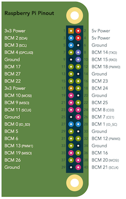

# react-pinout [![npm package][npm-badge]][npm]

RaspberryPi pinout React component

Heavily inspired from [pinout.xyz](http://pinout.xyz)



[Demo][demo]

## Usage

```js
import { RaspberryPi } from 'react-pinout'

const RaspberryPi = <RaspberryPi pins={ pins } onClick={ pin => redirect(pin.href) } />
```

`pins` is an array composed of 40 items :

```json
{
  "physicalPort": 1,
  "href": "/pinout/pin1_3v3_power",
  "title": "",
  "details": "",
  "label": "3v3 Power",
  "shape": "square",
  "color": "#B58900"
}
```

[npm-badge]: https://img.shields.io/npm/v/react-pinout.png?style=flat-square
[npm]: https://www.npmjs.org/package/react-pinout

[demo]: http://revolunet.github.io/react-pinout
